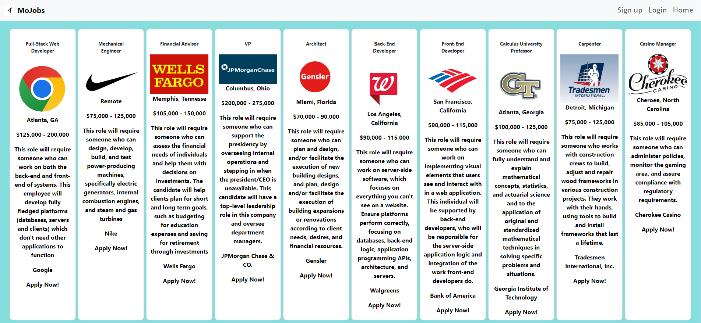

# MoJobs (Rough Draft)

## Table-of-Contents

* [Description](#description)
* [Usage](#usage)
* [Technologies](#technologies)
* [Collaborators](#collaborators)

## [Description](#table-of-contents)

MoJobs is an is user-friendly and provides beneficial insights, including salary ranges and job descriptions. These jobs range from entry level positions all the way through senior level positions. So the user will be able to find a job that suits their needs.

## [Usage](#table-of-contents)
 On the landing page, users will be able to create an account or login. Clicking the 'Find Jobs' button presents the user with a varity of jobs to pick from. The last step is for users to click the "Apply Now!" button to become one step closer to their new career. 

## [Technologies](#table-of-contents)

* Node.js
* Express.js
* Handlebars.js
* dotenv
* MySQL
* bcrypt

## [Collaborators](#table-of-contents)

* [Julianne Johnson](https://github.com/juella205)

* [Pedro Guerra](https://github.com/pguerra98)

* [Ohmarx Paniagua](https://github.com/Ohmarxp)

* [Stephen Spearman Jr.](https://github.com/DenimB96)

* [Nathaniel Geurin](https://github.com/Nateg5151)

* [Paul Song](https://github.com/psong1)

## [Application](#application)

* https://secret-tundra-26696.herokuapp.com/

